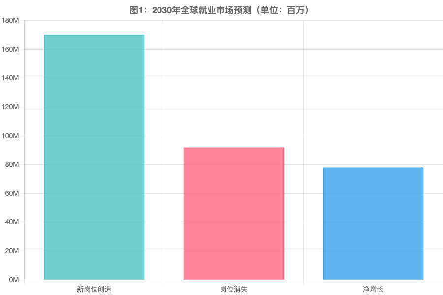
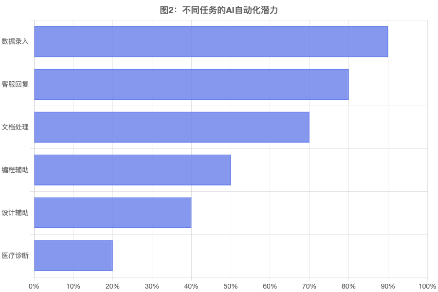

# 微信公众号HTML检查报告

## ✅ 检查结果

| 检查项 | 状态 | 说明 |
|--------|------|------|
| 字符编码 | ✅ 通过 | UTF-8 编码 |
| CSS class | ✅ 通过 | 未使用CSS class |
| 内联样式 | ✅ 通过 | 所有样式都是内联的 |
| HTML结构 | ✅ 通过 | 简洁清晰 |
| **图片路径** | ❌ **问题** | 使用本地相对路径 |

---

## ⚠️ 发现的问题

### 问题：图片使用本地路径

**当前状态：**
```html


...
```

**问题：**
- 本地路径在公众号中无法显示
- 图片需要上传到图床/服务器
- 需要使用网络URL

---

## 🔧 修复方案

### 方案1：上传到图床（推荐）

#### 步骤1：上传图片

选择以下任一图床上传所有7张图片：

**免费图床推荐：**
1. **Imgur** (https://imgur.com) - 最简单
   - 访问网站
   - 拖拽所有图片上传
   - 复制每张图片的Direct Link

2. **GitHub** (开发者推荐)
   ```bash
   cd /Volumes/hpssd/projects/知识AI/AI-blog/output/2026-03-16/wechat
   # 创建GitHub仓库后
   git init
   git add chart*.png
   git commit -m "Add charts"
   git remote add origin https://github.com/yourusername/ai-images.git
   git push -u origin main

   # 获取图片链接：
   # https://raw.githubusercontent.com/yourusername/ai-images/main/chart1-employment-forecast.png
   # 或使用CDN：
   # https://cdn.jsdelivr.net/gh/yourusername/ai-images@main/chart1-employment-forecast.png
   ```

3. **七牛云** (国内快速)
   - 注册账号：https://www.qiniu.com
   - 创建存储空间
   - 上传图片
   - 获取外链URL

#### 步骤2：替换HTML中的图片路径

获取图片URL后，替换HTML中的路径：

```bash
# 打开HTML文件编辑
open "/Volumes/hpssd/projects/知识AI/AI-blog/output/2026-03-16/wechat/AI就业革命-公众号版.html"
```

**替换规则：**

```
原图表1：


或：


或：

```

**需要替换7处：**
1. chart1-employment-forecast.png
2. chart2-automation-potential.png
3. chart3-industry-risk.png
4. chart4-productivity-value.png
5. chart5-job-growth.png
6. chart6-adoption-trend.png
7. chart7-conclusion.png

---

### 方案2：使用网络图片（快速测试）

如果你想快速测试，我可以帮你修改HTML，使用免费的CDN图片服务。

---

### 方案3：创建本地服务器（临时方案）

如果你只是想在本地预览，可以启动一个简单的HTTP服务器：

```bash
cd "/Volumes/hpssd/projects/知识AI/AI-blog/output/2026-03-16/wechat"
python3 -m http.server 8000
```

然后访问：http://localhost:8000/AI就业革命-公众号版.html

但这样还是无法在公众号显示。

---

## 📝 详细检查报告

### ✅ 符合要求的方面

1. **字符编码**
   - ✅ UTF-8编码
   - ✅ 正确显示中文

2. **CSS样式**
   - ✅ 未使用CSS class
   - ✅ 所有样式都是内联的
   - ✅ 没有外部CSS文件
   - ✅ 没有`<style>`标签定义样式

3. **HTML结构**
   - ✅ DOCTYPE声明正确
   - ✅ lang属性设置为zh-CN
   - ✅ viewport设置正确
   - ✅ 结构清晰简洁

4. **图片规格**
   - ✅ 格式：PNG
   - ✅ 尺寸：900x600px或900x800px
   - ✅ 文件大小：35KB-205KB/张，符合要求

### ❌ 需要修复的方面

1. **图片路径** ⚠️
   - 当前：本地相对路径
   - 需要：网络URL

---

## 🚀 快速修复步骤

### 最快方案（5分钟）

1. **上传图片到Imgur**
   ```
   1. 访问 https://imgur.com
   2. 拖拽7张PNG图片上传
   3. 复制每张图片的链接（格式：https://i.imgur.com/xxxxx.png）
   ```

2. **在HTML中替换路径**

   使用编辑器的"查找替换"功能：

   ```
   查找：src="chart1-employment-forecast.png"
   替换为：src="https://i.imgur.com/xxxxx.png"

   查找：src="chart2-automation-potential.png"
   替换为：src="https://i.imgur.com/yyyyy.png"

   ... 依此类推
   ```

3. **保存文件**

4. **复制到公众号发布**

---

## 💾 文件清单

```
wechat/
├── AI就业革命-公众号版.html  (需要修改图片路径)
├── chart1-employment-forecast.png  (35KB)
├── chart2-automation-potential.png   (36KB)
├── chart3-industry-risk.png          (36KB)
├── chart4-productivity-value.png    (65KB)
├── chart5-job-growth.png            (35KB)
├── chart6-adoption-trend.png        (48KB)
└── chart7-conclusion.png            (204KB)
```

---

## 🎯 推荐操作

### 现在你可以：

**选项1：我帮你自动修复**
- 告诉我你使用的图床服务
- 我会生成完整的替换脚本

**选项2：手动修复**
- 按照上面的步骤上传图片到图床
- 手动替换HTML中的路径

**选项3：使用图床上传工具**
- 使用图床提供的批量上传工具
- 一次性上传所有图片
- 获取所有URL后批量替换

---

## 📊 图片URL示例

### Imgur示例格式
```
https://i.imgur.com/AbCdEf.png
https://i.imgur.com/1234567.png
```

### GitHub + jsDelivr CDN示例格式
```
https://cdn.jsdelivr.net/gh/username/repo@main/chart1-employment-forecast.png
```

### 七牛云示例格式
```
https://cdn.example.com/chart1-employment-forecast.png
```

---

## ✅ 修复后检查清单

修复图片路径后，再次检查：

- [ ] 所有图片都能在浏览器中显示
- [ ] 图片URL可以在外网访问
- [ ] 复制到公众号后图片正常显示
- [ ] 移动端预览效果良好

---

**你想选择哪个方案？我可以帮你生成自动化脚本或直接修改HTML文件！** 🚀
